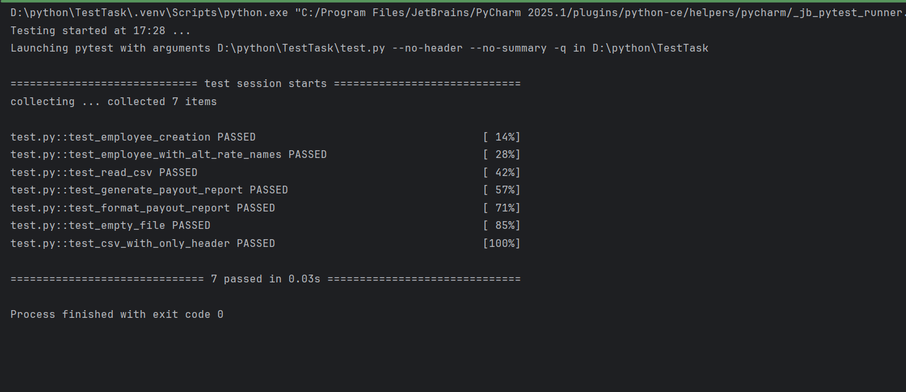

```
python Main.py csv_files --report payout
```
С помощью этой команды создается отчет, которые рассчитывает общие выплаты для каждого сотрудника, группирует данные по отделам и суммирует общие часы и выплаты по отделам.

```
Пример работы payout

Marketing
---------
       Alice Johnson      160.0       50.0 $   8000.00
        Henry Martin      150.0       35.0 $   5250.00
               Total      310.0            $  13250.00

Design
------
           Bob Smith      150.0       40.0 $   6000.00
      Carol Williams      170.0       60.0 $  10200.00
               Total      320.0            $  16200.00

HR
--
           Grace Lee      160.0       45.0 $   7200.00
           Ivy Clark      158.0       38.0 $   6004.00
         Liam Harris      155.0       42.0 $   6510.00
               Total      473.0            $  19714.00

Sales
-----
         Karen White      165.0       50.0 $   8250.00
           Mia Young      160.0       37.0 $   5920.00
               Total      325.0            $  14170.00

```

```
python Main.py csv_files --report avg_rate
```
С помощью этой команды состается отчет о средней ставке, в котором показывается средняя почасовая ставка по отделам, количество сотрудников в каждом отделе и список сотрудником по именам в отделах.

```
Пример работы avg_rate
========================================

Отдел: Marketing
Количество сотрудников: 2
Средняя ставка: $42.50/час
Сотрудники: Alice Johnson, Henry Martin

Отдел: Design
Количество сотрудников: 2
Средняя ставка: $50.00/час
Сотрудники: Bob Smith, Carol Williams

Отдел: HR
Количество сотрудников: 2
Средняя ставка: $41.50/час
Сотрудники: Grace Lee, Ivy Clark
```


Тесты

